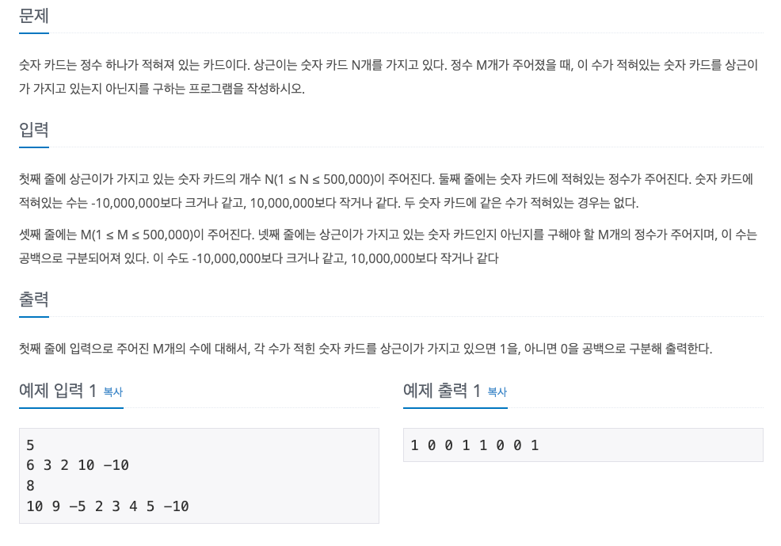

<!-- TOC -->
* [문제](#)
* [코드](#)
<!-- TOC -->

# 문제
> 숫자 카드



# 코드
```java
import java.util.*;
import java.util.stream.Collectors;

public class Main {
    public static void main(String[] args) {

        int[] sangSuNum = {6, 3, 2, 10, -10};
        int[] cardNum = {10, 9, -5, 2, 3, 4, 5, -10};

        Map<Integer, Integer> sangSuHaveCard = extracted(sangSuNum);
        Map<Integer, Integer> haveCard = extracted(cardNum);

        List<Integer> collect = sangSuHaveCard.values().stream()
                .map(o -> haveCard.containsValue(o) ? 1 : 0)
                .collect(Collectors.toList());

    }

    private static Map<Integer, Integer> extracted(int[] num) {
        return Arrays.stream(num)
                .boxed()
                .collect(Collectors.toMap(key -> key, value -> value));
    }
}

```