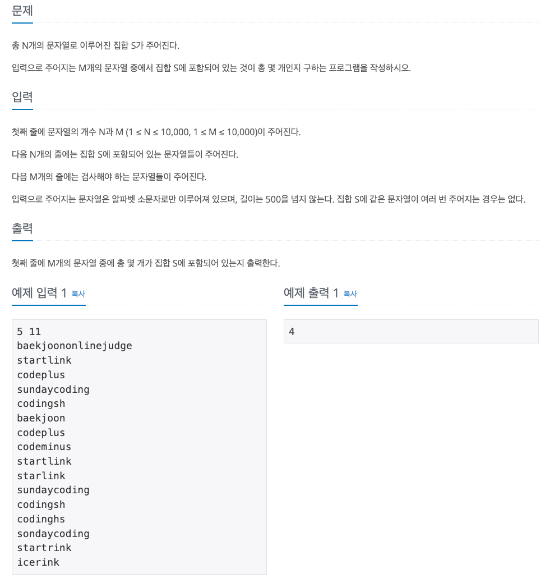

<!-- TOC -->
* [문제](#)
* [코드](#)
<!-- TOC -->

# 문제
> 문자열 집합



# 코드
```java
import java.util.*;

public class Test {
    public static void main(String[] args) {

        List<String> ns = new ArrayList<>(Arrays.asList("baekjoononlinejudge", "startlink", "codeplus", "sundaycoding", "codingsh"));
        List<String> ms = new ArrayList<>(Arrays.asList("baekjoon", "codeplus", "codeminus", "startlink", "starlink", "sundaycoding", "codingsh", "codinghs", "sondaycoding", "startrink", "icerink"));

        long count = ns.stream()
                .filter(ms::contains).count();

        System.out.println(count);
    }
}
```